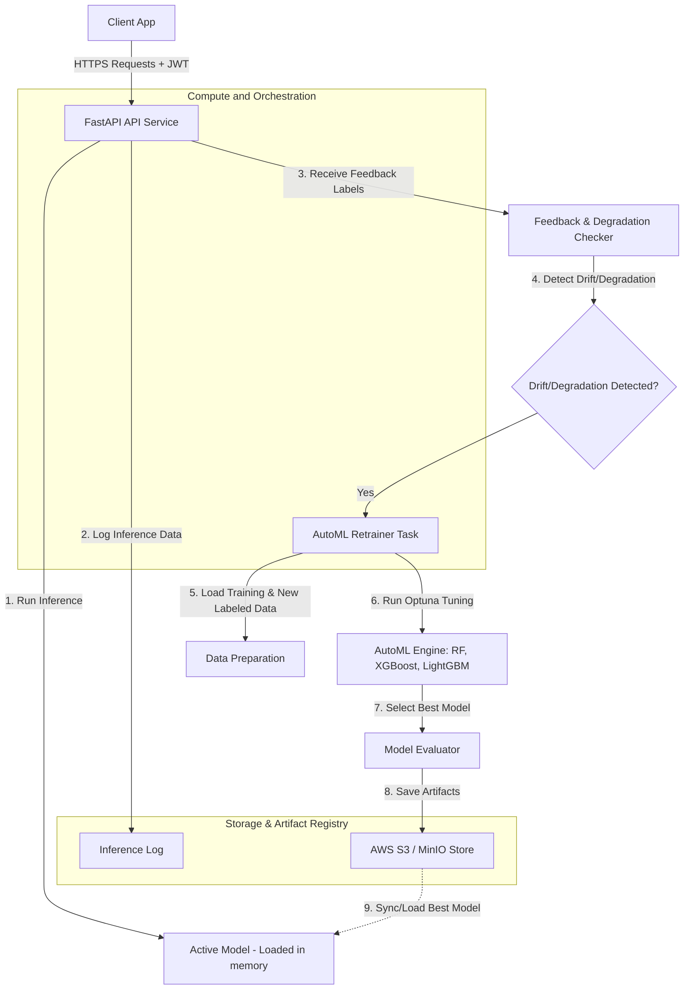

# AutoML MLOps Pipeline with Self-Healing, Drift Detection, and Secure API

This implementation plan outlines the creation of a production-grade MLOps pipeline that includes automated machine learning (AutoML) training, continuous data drift detection, self-healing automated retraining, secure JWT-based API endpoints, AWS S3 storage (with local MinIO emulation), and Docker-based orchestration.

---

## User Review Required

> [!IMPORTANT]
> **Key Decisions & Requirements**
> 1. **Default Dataset**: We will generate a synthetic tabular dataset (e.g., credit card default or bank churn prediction) with numerical and categorical features to demonstrate data drift (KS-test, PSI) and self-healing capabilities out of the box.
> 2. **S3 Storage / Local Development**: For testing and running locally without requiring AWS credentials immediately, we will configure the system to support a local folder fallback or a local **MinIO** service inside Docker Compose. If AWS environment variables are set, it will seamlessly write to AWS S3.
> 3. **Model Tuning**: We will use **Optuna** to optimize Random Forest, XGBoost, and LightGBM models. To prevent long wait times during local runs, the number of Optuna trials will be set to a small default (e.g., 5 trials per model), configurable via environment variables.

---

## Proposed Architecture



---

## Proposed Changes

We will organize the code under `src/` and support files at the root level.

### 1. Configuration & Storage

#### [NEW] [config.py](file:///media/momin/New%20Volume2/mlops/Untitled%20Folder/src/config.py)
Loads configurations from environment variables, including:
- JWT signing keys and expiration settings.
- Drift thresholds (KS-test p-value, PSI threshold).
- Performance degradation thresholds.
- AWS S3 settings (access keys, region, bucket, and S3 endpoint override for MinIO).

#### [NEW] [s3_manager.py](file:///media/momin/New%20Volume2/mlops/Untitled%20Folder/src/storage/s3_manager.py)
A wrapper class around `boto3` that:
- Connects to AWS S3 (or MinIO if `S3_ENDPOINT_URL` is set).
- Handles saving and loading trained model binaries (using `joblib`), scaler objects, and evaluation/drift metadata.
- Gracefully falls back to saving files on the local disk if no cloud storage config is found, enabling robust execution in offline development environments.

---

### 2. Machine Learning Core (AutoML & Drift)

#### [NEW] [dataset.py](file:///media/momin/New%20Volume2/mlops/Untitled%20Folder/src/ml/dataset.py)
- Utility to generate or mock a baseline classification dataset (e.g., credit card risk prediction) containing continuous and categorical features.
- Utility to generate *drifted* validation batches (shifting distributions) to allow manual or automated testing of the drift detector.

#### [NEW] [drift.py](file:///media/momin/New%20Volume2/mlops/Untitled%20Folder/src/ml/drift.py)
- **Kolmogorov-Smirnov (KS) Test**: Compares baseline continuous features with inference features to calculate the p-value.
- **Population Stability Index (PSI)**: Quantifies the degree of shift in variable distributions over time.
- Compiles a detailed report of drift per feature and flags overall data drift if threshold conditions are breached (e.g., average PSI > 0.25, or > 30% of features show KS p-value < 0.05).

#### [NEW] [automl.py](file:///media/momin/New%20Volume2/mlops/Untitled%20Folder/src/ml/automl.py)
- AutoML engine integrating `scikit-learn` (Random Forest), `xgboost`, and `lightgbm`.
- Uses **Optuna** to automatically search the hyperparameter space.
- Returns the best-performing model based on validation F1-score/Accuracy, along with its metadata.

---

### 3. API Gateway & Security

#### [NEW] [auth.py](file:///media/momin/New%20Volume2/mlops/Untitled%20Folder/src/api/auth.py)
- Handles hashing password credentials, creating JWT access tokens, and verifying signature authenticity.
- Protects API routes with a dependency checking function `get_current_user`.

#### [NEW] [schemas.py](file:///media/momin/New%20Volume2/mlops/Untitled%20Folder/src/api/schemas.py)
Pydantic data models defining the schemas for:
- User login credentials and JWT response.
- Model inputs (inference features) and predictions.
- Labeled feedback data.
- Drift analysis reports.

#### [NEW] [main.py](file:///media/momin/New%20Volume2/mlops/Untitled%20Folder/src/api/main.py)
FastAPI application that serves:
- `POST /token`: Authenticate user and return a JWT.
- `POST /predict`: Protected route. Performs predictions, stores prediction features locally or in S3 for drift tracking.
- `GET /drift-report`: Protected route. Computes and returns the drift statistics (KS, PSI) comparing current inference queries against reference training data.
- `POST /feedback`: Protected route. Accepts ground-truth labels for predictions to measure model performance. If F1-score drops below `PERFORMANCE_THRESHOLD_F1` or if data drift is detected, triggers **Self-Healing** retraining as a background task.
- `POST /retrain`: Protected route. Manually triggers AutoML model retraining.
- `GET /health`: Public route. Returns system status and details of the current model in use.

---

### 4. Deployment & Infrastructure

#### [NEW] [requirements.txt](file:///media/momin/New%20Volume2/mlops/Untitled%20Folder/requirements.txt)
Python library dependencies: `fastapi`, `uvicorn`, `pydantic`, `pyjwt`, `cryptography`, `pandas`, `numpy`, `scipy`, `scikit-learn`, `xgboost`, `lightgbm`, `optuna`, `boto3`, `python-dotenv`, `joblib`.

#### [NEW] [Dockerfile](file:///media/momin/New%20Volume2/mlops/Untitled%20Folder/Dockerfile)
Multi-stage build Dockerfile optimizing size and caching steps, setting up a non-root user for security.

#### [NEW] [docker-compose.yml](file:///media/momin/New%20Volume2/mlops/Untitled%20Folder/docker-compose.yml)
Orchestrates:
- **API Service**: Running the FastAPI app.
- **MinIO Service**: Local S3-compatible service mimicking AWS S3.
- **MinIO Provisioner**: Seed bucket creation.

#### [NEW] [.env.example](file:///media/momin/New%20Volume2/mlops/Untitled%20Folder/.env.example)
Example environment variable template containing all defaults.

#### [NEW] [deploy.yml](file:///media/momin/New%20Volume2/mlops/Untitled%20Folder/.github/workflows/deploy.yml)
GitHub Actions workflow checking code quality (linting), running pytest, and outlining deployment to AWS EC2.

---

## Verification Plan

### Automated Tests
We will implement unit tests under `tests/` covering:
- **Auth**: JWT generation, success/failure login, protected endpoints rejection.
- **Drift**: Asserting drift is flagged correctly when given synthetic shifted distributions vs non-shifted distributions.
- **AutoML**: Verification of Optuna training outputting valid models and saving artifacts.

Running tests via:
```bash
python -m pytest tests/
```

### Manual Verification
1. Start the stack locally: `docker compose up --build -d`
2. Authenticate and obtain JWT token: `POST /token`
3. Send normal predictions: `POST /predict` (verify 200 OK)
4. Trigger data drift by sending queries with modified feature distributions.
5. Retrieve drift status: `GET /drift-report` (verify drift detection flags it).
6. Submit feedback with mismatching labels to trigger self-healing: `POST /feedback`.
7. Observe logs to verify that Optuna retraining commences in the background and a new, active model is successfully loaded.
